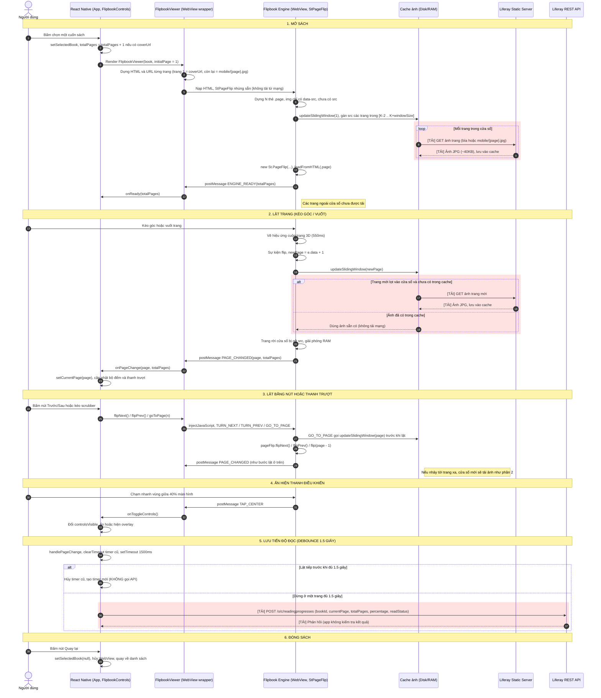

# MEKOBOOK MOBILE - 3D FLIPBOOK VIEWER

Ứng dụng di động đọc sách 3D Flipbook tích hợp **Liferay Portal 7.4 GA132 CE** làm Headless CMS / Backend.

---

## 1. Hướng Dẫn Khởi Chạy Nhanh Cho Developer (Quick Start)

### Yêu cầu tiên quyết:
- Node.js >= 18 và npm >= 9
- Ứng dụng **Expo Go** cài trên điện thoại (tải từ App Store hoặc Google Play)
- Điện thoại và máy tính chạy Dev kết nối chung một mạng Wi-Fi

### 3 bước khởi chạy ứng dụng:
```bash
# Bước 1: Cài đặt các gói phụ thuộc
npm install

# Bước 2: Tạo file cấu hình môi trường cục bộ
cp .env.example .env

# Bước 3: Khởi động Metro Bundler với tùy chọn xóa cache
npx expo start -c
```
Terminal sẽ hiển thị mã QR:
- Trên iPhone: Mở ứng dụng **Camera**, quét mã QR để mở app trong Expo Go.
- Trên Android: Mở ứng dụng **Expo Go**, chọn **Scan QR code**.

---

## 2. Hướng Dẫn Cấu Hình Môi Trường Dev (Developer Configuration Guide)

File cấu hình `.env` đóng vai trò định tuyến toàn bộ kết nối mạng giữa ứng dụng di động và máy chủ Liferay.

### 2.1. Chi tiết các biến môi trường trong `.env`

| Tên biến | Mô tả | Giá trị mẫu / Mặc định |
|---|---|---|
| `API_BASE_URL` | Địa chỉ gốc của máy chủ Liferay Headless API | `http://<IP_MAY_CHU_LAN>:8080` |
| `STATIC_FLIPBOOK_BASE_URL` | Thư mục chứa gói ảnh trang lật 3D tĩnh | `http://<IP_MAY_CHU_LAN>:8080/flipbooks/` |
| `OAUTH_TOKEN_URL` | Đường dẫn lấy Access Token OAuth 2.0 | `/o/oauth2/token` |
| `OAUTH_CLIENT_ID` | Client ID ứng dụng di động đăng ký trên Liferay | Nhận từ quản trị viên Liferay |
| `OAUTH_CLIENT_SECRET` | Client Secret ứng dụng di động | Nhận từ quản trị viên Liferay |
| `DEMO_USER_USERNAME` | Tên tài khoản test xác thực Basic Auth | Tài khoản thử nghiệm dev |
| `DEMO_USER_PASSWORD` | Mật khẩu tài khoản test | Mật khẩu thử nghiệm dev |
| `DEMO_USER_ID` | ID định danh người dùng trên Liferay | ID số nguyên (ví dụ: 32236) |
| `LIFERAY_SITE_ID` | Site ID phân vùng dữ liệu Liferay | `20117` |
| `CACHE_SLIDING_WINDOW_SIZE` | Số lượng trang nạp trước vào bộ nhớ đệm (Sliding Window) | `4` (tối ưu RAM dưới 40MB) |

---

### 2.2. Quy tắc kết nối mạng di động (RẤT QUAN TRỌNG)

1. **Tuyệt đối không dùng `localhost` hoặc `127.0.0.1` trong `.env`:**
   - Ứng dụng chạy trên thiết bị di động thật (điện thoại iOS/Android).
   - Nếu để `localhost`, điện thoại sẽ tự gửi request vào chính nó và bị lỗi kết nối mạng (`Network request failed`).
   - Phải sử dụng **địa chỉ IP nội bộ của máy chủ trong mạng LAN** (ví dụ: `http://192.168.1.xxx:8080`).

2. **Cách xác định IP máy tính chạy server:**
   - **Windows:** Mở Command Prompt hoặc PowerShell, gõ `ipconfig`, tìm dòng `IPv4 Address` thuộc card mạng Wi-Fi (ví dụ: `192.168.1.254`).
   - **macOS / Linux:** Mở Terminal, gõ `ifconfig | grep inet` hoặc `ip a`.

3. **Cấu hình khi làm việc từ xa (Khác mạng Wi-Fi):**
   - Nếu điện thoại và máy tính không cùng mạng nội bộ, sử dụng đường hầm **ngrok Tunnel**:
     ```env
     API_BASE_URL=https://<your-subdomain>.ngrok-free.dev
     STATIC_FLIPBOOK_BASE_URL=https://<your-subdomain>.ngrok-free.dev/flipbooks/
     ```

---

## 3. Bảng Tóm Tắt Cơ Chế Hoạt Động Của Flipbook

| Hạng mục | Cơ chế hiện tại trong mã nguồn |
|---|---|
| **Kiến trúc** | React Native (Expo) bọc một WebView chạy thư viện StPageFlip (nhúng sẵn 100% offline trong app, không tải từ mạng). Hiệu ứng lật 3D chạy hoàn toàn trong WebView với tốc độ 60 FPS |
| **Dữ liệu truyền về client** | Metadata sách là JSON, lấy từ Liferay `/o/c/books`. Nội dung sách là ảnh JPG từng trang (`mobile/{page}.jpg`, ~40KB/trang) lấy từ static server, không phải file zip hay PDF. Trang 1 là ảnh bìa (`coverUrl`), nội dung bắt đầu từ trang 2 |
| **Cơ chế tải ảnh (Sliding Window)** | Mở sách chỉ tải các trang trong cửa sổ `[K-2 .. K+windowSize]`, không tải cả cuốn. Khi lật, cửa sổ dịch theo: trang mới được gán `src` để tải, trang xa bị gỡ `src` để giải phóng RAM. Ảnh đã tải nằm trong disk cache của WebView, nên lật lại không tải lại từ server |
| **Giao tiếp React Native và WebView** | WebView gửi lên: `ENGINE_READY`, `PAGE_CHANGED`, `TAP_CENTER`. React Native gửi xuống bằng `injectJavaScript`: `TURN_NEXT`, `TURN_PREV`, `GO_TO_PAGE` |
| **Lưu tiến độ đọc** | Mỗi lần đổi trang, app chờ 1.5 giây (Debounce). Nếu người đọc không lật tiếp thì mới gửi một `POST /o/c/readingprogresses`. Lật liên tục thì không gọi API để tránh làm nghẽn máy chủ |
| **Giao diện** | Nền sáng (Light Mode), màu xanh lá chủ đạo `#059669`. Mỗi trang có khung viền xanh `2.5px` để tách biệt với nền. Không sử dụng emoji (dùng vector icons Ionicons), không watermark, không debug overlay |
| **Xác thực** | Đang sử dụng Basic Auth `phuongthao` / `admin` để dev test nhanh. Dev tiếp theo sẽ chuyển sang OAuth 2.0 Client Credentials |

---

## 4. Sơ Đồ Tuần Tự (Sequence Diagram - Mở Sách Đến Đóng Sách)


